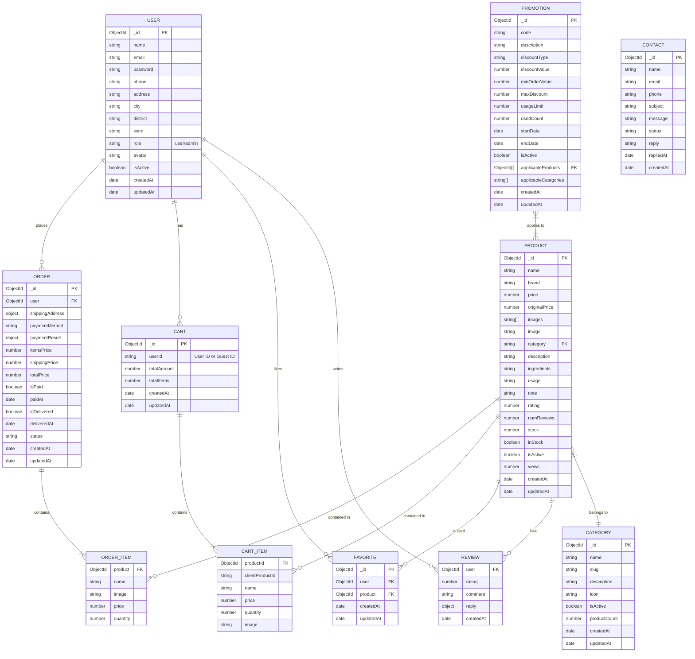

# Mô hình Dữ liệu Quan niệm (ERD) - Healthycare

Tài liệu này mô tả mô hình thực thể kết hợp (ERD) cho dự án Healthycare, dựa trên các schema Mongoose hiện có trong backend.

## Sơ đồ ERD (Mermaid)

## Chi tiết các Thực thể

### 1. User (Người dùng)
Lưu trữ thông tin tài khoản người dùng và quản trị viên.
- **Quan hệ**:
    - 1 User có thể có nhiều Order.
    - 1 User có thể có 1 Cart (hoặc nhiều phiên cart theo thời gian).
    - 1 User có thể có nhiều Favorite.
    - 1 User có thể viết nhiều Review cho các Product khác nhau.

### 2. Product (Sản phẩm)
Lưu trữ thông tin chi tiết về sản phẩm.
- **Quan hệ**:
    - Thuộc về 1 Category (thông qua trường `category` lưu tên hoặc slug, tuy nhiên trong thiết kế chuẩn nên là ObjectId reference).
    - Có thể nằm trong nhiều Order (thông qua OrderItem).
    - Có thể nằm trong nhiều Cart (thông qua CartItem).
    - Có thể được nhiều User yêu thích (Favorite).
    - Có thể có nhiều Review từ User (Review được nhúng trong Product document).
    - Có thể được áp dụng nhiều Promotion.

### 3. Category (Danh mục)
Phân loại sản phẩm.
- **Quan hệ**:
    - Chứa nhiều Product.

### 4. Order (Đơn hàng)
Lưu trữ thông tin đơn hàng đã đặt.
- **Quan hệ**:
    - Thuộc về 1 User.
    - Chứa danh sách OrderItem (nhúng).

### 5. Cart (Giỏ hàng)
Lưu trữ giỏ hàng tạm thời của người dùng hoặc khách vãng lai.
- **Quan hệ**:
    - Liên kết với User (hoặc guest ID).
    - Chứa danh sách CartItem (nhúng).

### 6. Favorite (Yêu thích)
Lưu trữ danh sách sản phẩm yêu thích của người dùng.
- **Quan hệ**:
    - Liên kết User và Product (bảng trung gian).

### 7. Promotion (Khuyến mãi)
Lưu trữ thông tin mã giảm giá và chương trình khuyến mãi.
- **Quan hệ**:
    - Có thể áp dụng cho danh sách Product cụ thể hoặc Category cụ thể.

### 8. Contact (Liên hệ)
Lưu trữ tin nhắn liên hệ từ khách hàng.
- **Quan hệ**: Độc lập, không có khóa ngoại bắt buộc, nhưng có thể liên kết logic với User qua email.

### Ghi chú về thiết kế NoSQL (MongoDB)
- **Review**: Được thiết kế dưới dạng Embedded Document (nhúng) bên trong `Product` thay vì một collection riêng biệt, giúp tối ưu hóa việc đọc dữ liệu sản phẩm kèm đánh giá.
- **Order Items & Cart Items**: Cũng được nhúng trực tiếp vào `Order` và `Cart` để truy xuất nhanh.
- **Category trong Product**: Hiện tại schema `Product` lưu `category` dưới dạng String. Trong mô hình quan hệ chặt chẽ, đây thường là Reference (ObjectId) tới collection `Category`.
